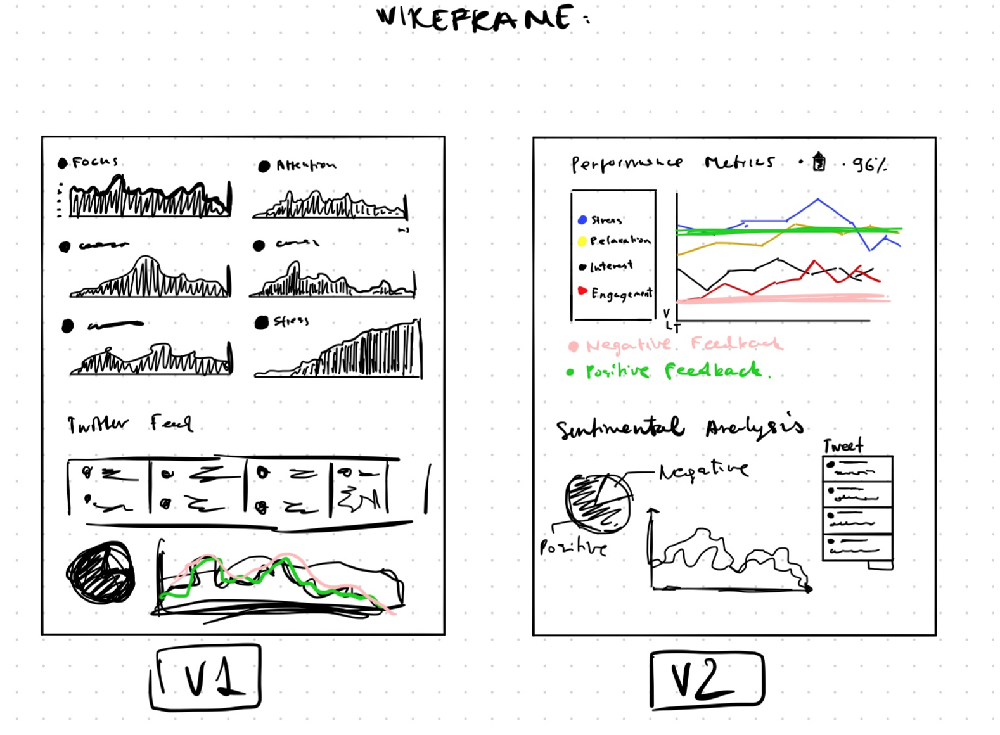
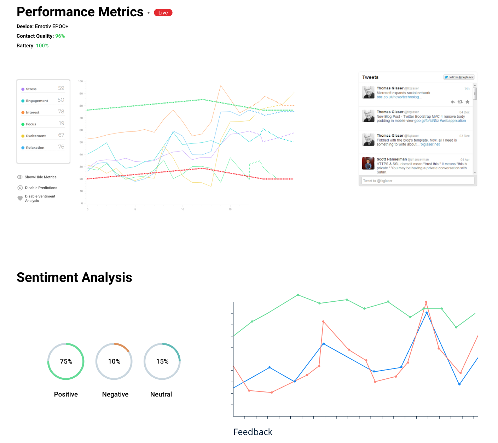

# Advanced Web Development - CST3130:CW2

## Coursework Requirements:

1. You create a website that displays numerical data, predictions about the numerical data and the results of

   sentiment analysis.

2. The numerical data will be obtained from web services. It cannot be obtained from web scraping. For

   example, it could be product price data from web services, stock prices, exchange rate prices, weather,

   football results, etc.

3. The text data for sentiment analysis will be obtained from web services, such as the Twitter API or Facebook

   Graph.

4. Machine learning will be used to make predictions about future values of the data.
5. You will also display synthetic data that we will provide to check your data visualization and machine

   learning.

6. All third party data will be stored in the cloud.
7. The front end of the website only has to display visualizations of the data, predictions about the data and the

   results of the sentiment analysis. No other functionality is required.

8. The code that downloads data from web services and uploads it to the cloud must be written in TypeScript.
9. Your website will be hosted on the cloud using serverless technology. Lambda functions on the server can be

   written in any programming language \(JavaScript is recommended\).

10. The front end of your website can use ordinary JavaScript or a JavaScript framework.
11. WebSockets will push new data items to subscribed clients.
12. The coursework and teaching materials will be based on Amazon Web Services \(AWS\). You are welcome to

    use a different cloud provider. However, we will only be able to provide very limited support with projects

    that are based on a different cloud provider.

## Deliverables:

Proposal document. This must contain: A. Brief description of the proposed website. B. Mock-ups of front end of website showing proposed data visualization. These can be pen and paper, Word, Inkscape etc. C. List of source\(s\) of numerical data. D. List of source\(s\) of data for sentiment analysis. E. Screenshot and URL of static website hosted on cloud.

## Proposal

### Description

This project aims to display real-time EEG processed brain-data which will be gathered by using a mobile Brainwear® device on the spot. The equipment I will be using for this coursework is called Emotiv EPOC+. Fortunately, the company has created an API suite, entitled Cortex, “to integrate Emotiv headset’s data streams with third-party software enabling to record data, create BCI applications or build custom games and apps.” With the support of the documentation that is provided by Emotiv \(https://emotiv.gitbook.io/cortex-api/\), I can use their Data Streams API to extract various performance metrics that are noted in Sources paragraph.

If the project will be carried out successfully before the deadline, I am considering implementation of Amazon Transcribe. As a result, it should assist with speech-to-text recognition in near real- time which could be connected to Twitter API and have an ability to post a tweet without the need of doing it manually.

### Sources

The numerical data will be presented in six performance metrics such as Stress, Engagement, Focus, Interest, Excitement and Relaxation. For the stats to fetch, the data will be processed in the Cortex Services using Raw EEG directly from the brain. To have the data displayed in real-time on the website, the device must be on the head during the demonstration.

The sentiment analysis will be carried out using Twitter's API to gather the needed text and AWS Comprehend analytic services to perform sentimental analysis on the textual data.

### Front-End visualisation

The first picture presents possible outcomes of the design. I began designing the first version but in the middle of the process, I had another idea how to execute the project more efficiently.

The second picture represents the final version of the front-end. The website was designed to remove any data from the metrics to have more focus on the statistics that matter in that particular moment. This way, the website has to be as simplified as possible without sacrificing the crucial data infographics like sentiment analysis or the performance metrics. As you can see, the metrics can be hidden by using one of the provided options in the interface - Show/Hide Metrics, Disable Predictions and Disable Sentiment Analysis. Once the method has been executed by clicking the option, the word Disable will turn to Enable.

Twitter’s feed is going to fetch daily news from major news outlets. AWS Comprehend will determine the status of accumulated news in the feed, whether it is positive, negative or neutral. By having the sentiment analysis working, the website will display the predictions of every metric in the case of what would happen if the subject \(who wears the headset\) would start reading daily news feed.

